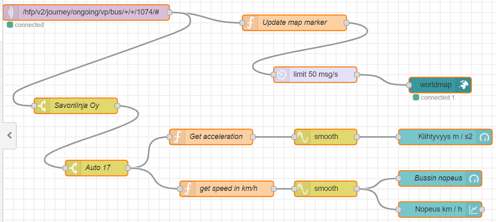

# Public transport IoT

This document presents the proof-of-concept implementation for a live dashboard of local buses in Helsinki.

The dashboard displays live locations, directions and delays for buses in the Helsinki metropolitan area. Live speed and acceleration is displayed for a single vehicle. Buses delayed over 60 seconds are shown in red, where as others are displayed in green.


Next steps for the project include utilizing Azure IoT for storing and analysing location data.

## High-frequency vehicle positioning

The solution is based on the High-frequency vehicle positioning API by [Digitransit](https://digitransit.fi/en/developers/apis/4-realtime-api/vehicle-positions/).


https://digitransit.fi/en/developers/apis/4-realtime-api/vehicle-positions/

### Message queue

MQTT server:

```
mqtts://mqtt.hsl.fi:8883/
```

Example message topic ([by Digitransit](https://digitransit.fi/en/developers/apis/4-realtime-api/vehicle-positions/)):

```
/hfp/v2/journey/ongoing/vp/bus/0055/01216/1069/1/Malmi/7:20/1130106/2/60;24/19/73/44
```

The topic is documented as follows ([see Digitransit](https://digitransit.fi/en/developers/apis/4-realtime-api/vehicle-positions/)):

```
/<prefix>/<version>/<journey_type>/<temporal_type>/<event_type>/<transport_mode>/<operator_id>/<vehicle_number>/<route_id>/<direction_id>/<headsign>/<start_time>/<next_stop>/<geohash_level>/<geohash>/#
```

Source: https://digitransit.fi/en/developers/apis/4-realtime-api/vehicle-positions/


## Node-RED

> Node-RED: Low-code programming for event-driven applications.
>
> https://nodered.org/

### Additional nodes used

[node-red-dashboard](https://flows.nodered.org/node/node-red-dashboard)

[node-red-node-smooth](https://flows.nodered.org/node/node-red-node-smooth)

[node-red-contrib-web-worldmap](https://flows.nodered.org/node/node-red-contrib-web-worldmap)

[node-red-contrib-azure-iot-hub](https://flows.nodered.org/node/node-red-contrib-azure-iot-hub)


### Running under Docker

https://nodered.org/docs/getting-started/docker

```shell
> docker run -it -p 1880:1880 --name nodered nodered/node-red
```

From [the documentation](https://nodered.org/docs/getting-started/docker):
```
docker run              - run this container... initially building locally if necessary
-it                     - attach a terminal session so we can see what is going on
-p 1880:1880            - connect local port 1880 to the exposed internal port 1880
--name mynodered        - give this machine a friendly local name
nodered/node-red        - the image to base it on
```

```shell
> docker start nodered --attach
```

```shell
> docker attach nodered
```

```log
> node-red-docker@1.0.3 start /usr/src/node-red
> node $NODE_OPTIONS node_modules/node-red/red.js $FLOWS "--userDir" "/data"

19 Feb 12:01:35 - [info]

Welcome to Node-RED
===================

19 Feb 12:01:35 - [info] Node-RED version: v1.0.3
19 Feb 12:01:35 - [info] Node.js  version: v10.18.0
19 Feb 12:01:35 - [info] Linux 4.9.184-linuxkit x64 LE
19 Feb 12:01:35 - [info] Loading palette nodes
19 Feb 12:01:36 - [info] Dashboard version 2.19.3 started at /ui
19 Feb 12:01:36 - [info] Settings file  : /data/settings.js
19 Feb 12:01:36 - [info] Context store  : 'default' [module=memory]
19 Feb 12:01:36 - [info] User directory : /data
19 Feb 12:01:36 - [warn] Projects disabled : editorTheme.projects.enabled=false
19 Feb 12:01:36 - [info] Flows file     : /data/flows.json
19 Feb 12:01:36 - [warn]

---------------------------------------------------------------------
Your flow credentials file is encrypted using a system-generated key.

If the system-generated key is lost for any reason, your credentials
file will not be recoverable, you will have to delete it and re-enter
your credentials.

You should set your own key using the 'credentialSecret' option in
your settings file. Node-RED will then re-encrypt your credentials
file using your chosen key the next time you deploy a change.
---------------------------------------------------------------------

19 Feb 12:01:36 - [info] Starting flows
19 Feb 12:01:36 - [info] Started flows
19 Feb 12:01:36 - [info] Server now running at http://127.0.0.1:1880/
19 Feb 12:01:37 - [info] [mqtt-broker:mqtt.hsl.fi] Connected to broker: mqtts://mqtt.hsl.fi:8883
```

### Node setup



See [flow.json](flow.json)

### UI

    http://localhost:1880/ui/


